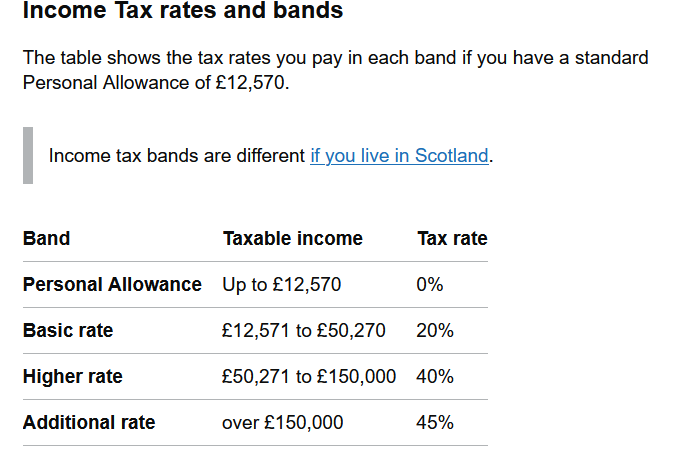

# uk_income_tax_calc

### Basic cli tool writen in python3 for checking your UK income tax liabilities.

#### Uk income tax:

Data correct on 19/03/2023. 

#### how to use:
+ When prompted just enter your total income and it will work out the rest.

###### [use at your own risk i'm not liable for your tax]
